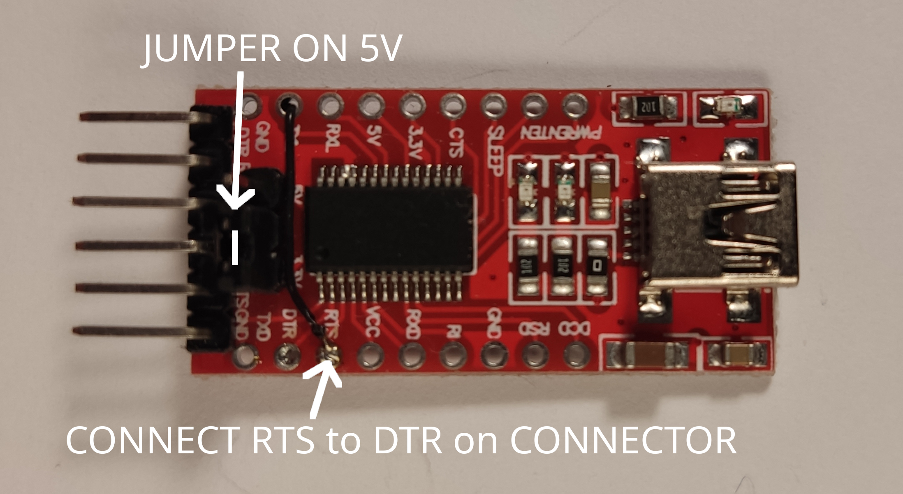
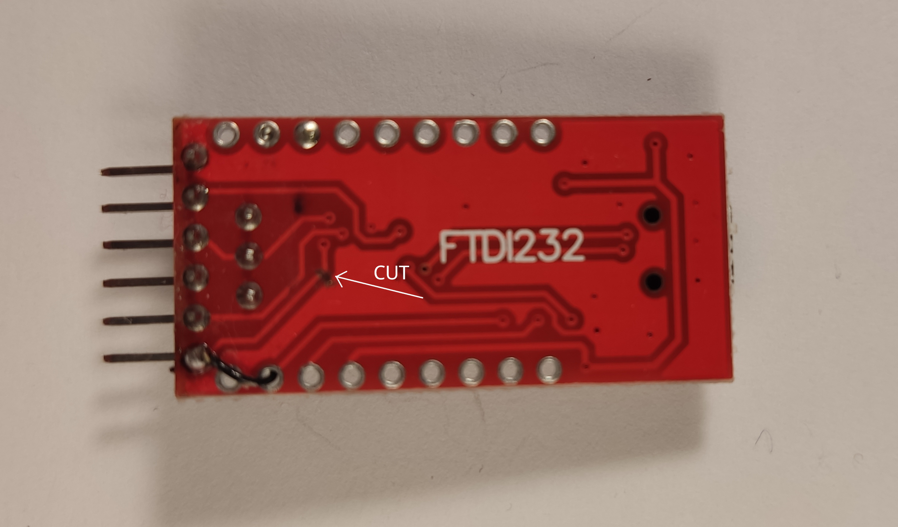
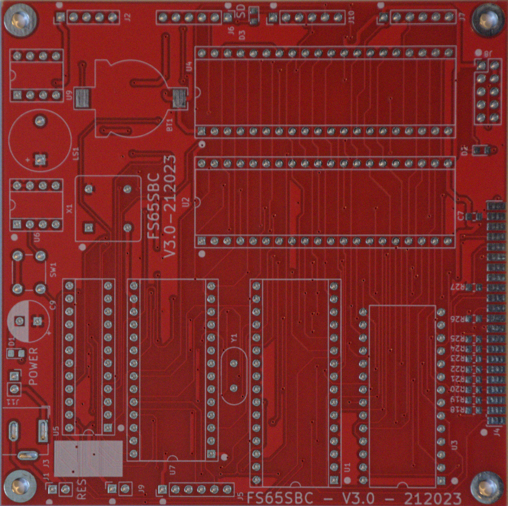
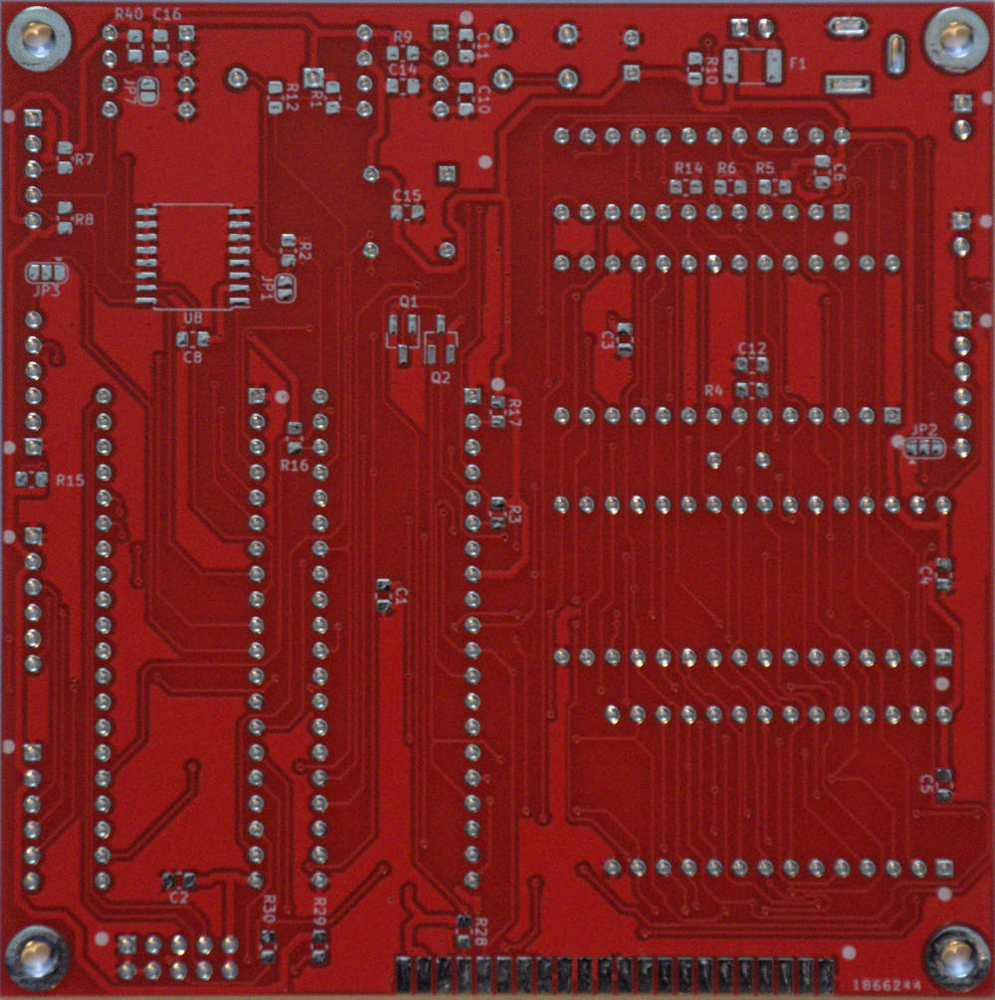
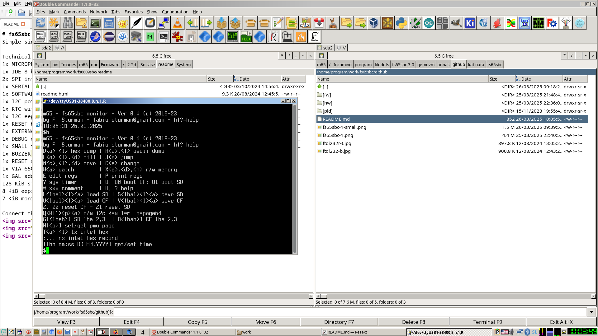

# fs65sbc
Simple single and small board (99.9 mm x 99.9 mm) computer with 6502/65C02

## Technical data:  
1x MICROPROCESSOR 65C02 @2MHz  
1x IDE 8 bit interface for CF card (read speed 86 kB/s)  
2x SPI interface for SD card  (read speed 5.6 kB/s)  
1x SERIAL PORT @38400 baud (38400-8-N-1) interrupt driven with handshake CTS/RTS  
1x SOFTWARE only tx serial port  
1x SYSTEM Timer 20 mS  
1x I2C port  
1x RTC with backup battery  
1x I2C eeprom AT24C256  
1x RESET button  
1x EXTERNAL reset pin  
1x DEBUG output pin  
1x SMALL interface connector  
1x BUZZER  
1x RESET supervisor  
1x VIA 65C02  
1x ACIA 65C51  
1x GAL address decoder  
128 KiB static ram with 8 KiB paged memory  
8 KiB (e)eprom  
7 KiB monitor m65  

### m65:    monitor m65 for fs65sbc  
### hw:     KICAD files  
### pld:    gal22v10 equations   
### img:    images and photos
### cpm-65: CPM-65 by Dietrich Lausberg https://github.com/dietrich-l for fs65sbc  
### bin:   PC utilities  

Connect the FS65SBC to PC using FT232RL modified USB-SERIAL adapters  
  
  
  
  
  
  

