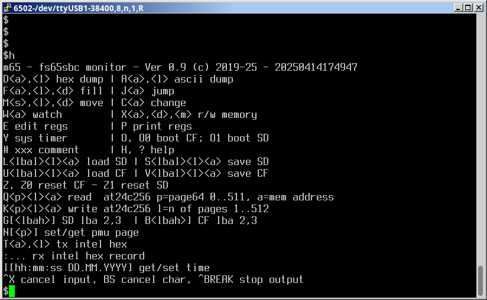

# M65 - monitor program for FS65SBC
Screenshoot of the H (HELP) command  

<pre>
H or ? help
# comment line
A&lt;a&gt;,&lt;l&gt; ascii dump: &lt;a&gt;=start address (HEX16), &lt;l&gt;=len of dump (HEX16)
D&lt;a&gt;,&lt;l&gt; hex dump  
F&lt;a&gt;,&lt;l&gt;,&lt;d&gt; fill memory: &lt;d&gt;=data byte for fill (HEX8)
M&lt;s&gt;,&lt;l&gt;,&lt;d&gt; move memory: &lt;s&gt;=start address (HEX16),
             &lt;d&gt;=destination address (HEX16)
C&lt;a&gt; change memory: enter hex numbers ENTER to change, ENTER skip
     to next address, CTRL-X exit
W&lt;a&gt; watch memory: CTRL-BREAK to exit
X&lt;a&gt;,&lt;d&gt;,&lt;m&gt; modify memory: d=data (HEX8), m=mode (HEX4): 0 change, 1 or, 2 and, 3 xor
   to set 4th bit @1000: X1000,8,1
   to clear first bit @E400: XE400,fe,2
   to invert bit 1, 2 ,3 and 4 @F000: XF000,F,3
E edit registers: enter hex numbers ENTER to change, ENTER skip, CTRL-X exit
P print registers
Y print system timer in HEX32 (1 tick = 20 ms)
O[&lt;n&gt;] boot: O or O0 boot CF, O1 boot SD
L&lt;lbal&gt;,&lt;l&gt;,&lt;a&gt; load SD sector: &lt;lbal&gt;=low part of LBA (HEX16), &lt;l&gt;=number of sectors to read (HEX16)
S&lt;lbal&gt;,&lt;l&gt;,&lt;a&gt; save SD sector
U&lt;lbal&gt;,&lt;l&gt;,&lt;a&gt; load CF sector
V&lt;lbal&gt;,&lt;l&gt;,&lt;a&gt; save CF sector
Z[&lt;n&gt;] reset card: Z, Z0 reset CF, Z1 reset SD
Q&lt;p&gt;,&lt;l&gt;,&lt;a&gt; read  at24c256: &lt;p&gt;=page64 0..511, &lt;a&gt;=memory address (HEX16)
K&lt;p&gt;,&lt;l&gt;,&lt;a&gt; write at24c256: &lt;l&gt;=n of pages 1..512
G[&lt;lbah&gt;] set high part of LBA for SD, G prints HLBA
B[&lt;lbah&gt;] set high part of LBA for CF, B prints HLBA
N[&lt;p&gt;] set/get pmu=paged memory unit: &lt;p&gt;=page (HEX4), N prints page
T&lt;a&gt;,&lt;l&gt; tx intel hex
:... rx intel hex record
I[hh:mm:ss DD.MM.YYYY] get/set RTC : I prints date-time
J[&lt;a&gt;] jump: J jumps to PC in registers

Commands are case insensitive, HEX4= 4 bit hex number
HEX8= 8 bit, HEX16= 16 bit, HEX32= 32 bit
[..]= optional parameter, command terminated by ENTER
CTRL-X cancels input, BS cancels last char, CTRL-BREAK stops output
</pre>
### Read sector CF @0030_0000 to memory @200
<pre>
$# set high lba to 0030
$B30
$# read one sector (00300) 0000
$U0,1,200
After reset lba high LBAH=0
</pre>
### Export one sector SD @0 to PC
<pre>
$# load sector 0 from SD  to memory @200
$L0,1,200
$# HEX dump memory @200 len=200 to terminal
$T200,200
Copy/paste data from PUTTY screen (or log file) to file.
</pre>
### Save file from PC to CF @1000
<pre>
bin2hex --offset=0x200 file # convert file to hex
sendsbc file.hex            # sens hex file to sbc @200
$# save data to SD @1000
$V1000,file_len_in_sectors,200
</pre>
### Test CF speed
<pre>
$# print start timer
$Y
$# 5x load 60 (96) sectors of 200 (512) B = 5 x 48 KiB = 240 KiB
$U0,60,200
$U0,60,200
$U0,60,200
$U0,60,200
$U0,60,200
$# print end timer
$Y
Compute the transfer rate: 240/((end_timer-start_timer)*0.02) in KiB/s
</pre>
### Set RTC
<pre>
$# use I command - H, M, S, d, m with 2 digit, y with 4 digits
$IHH:MM:SS dd.mm.yyyy
or from PC
65rtc
</pre>

